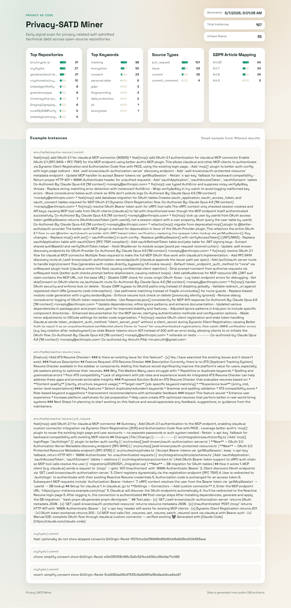
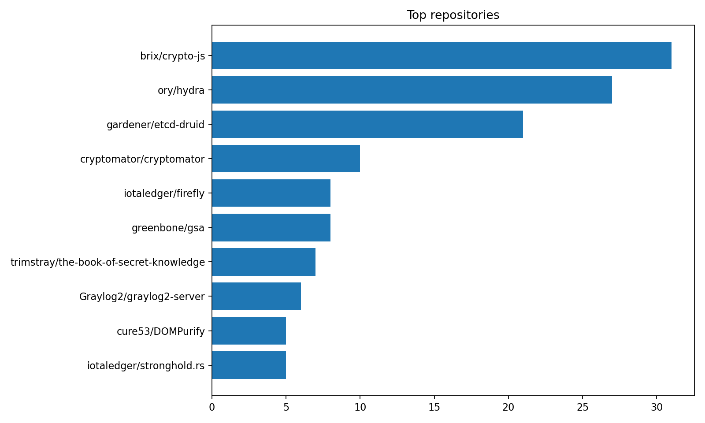
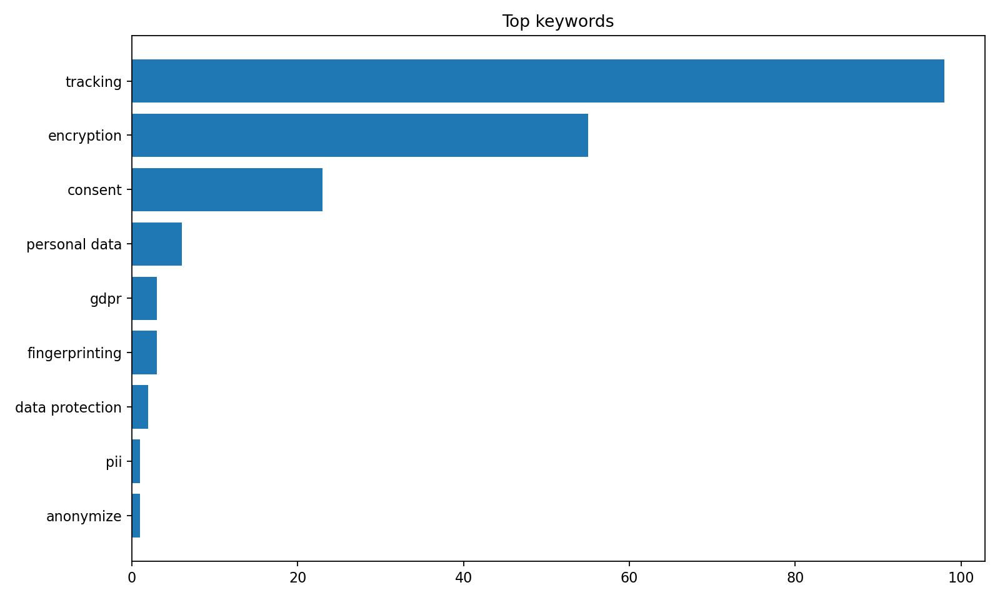
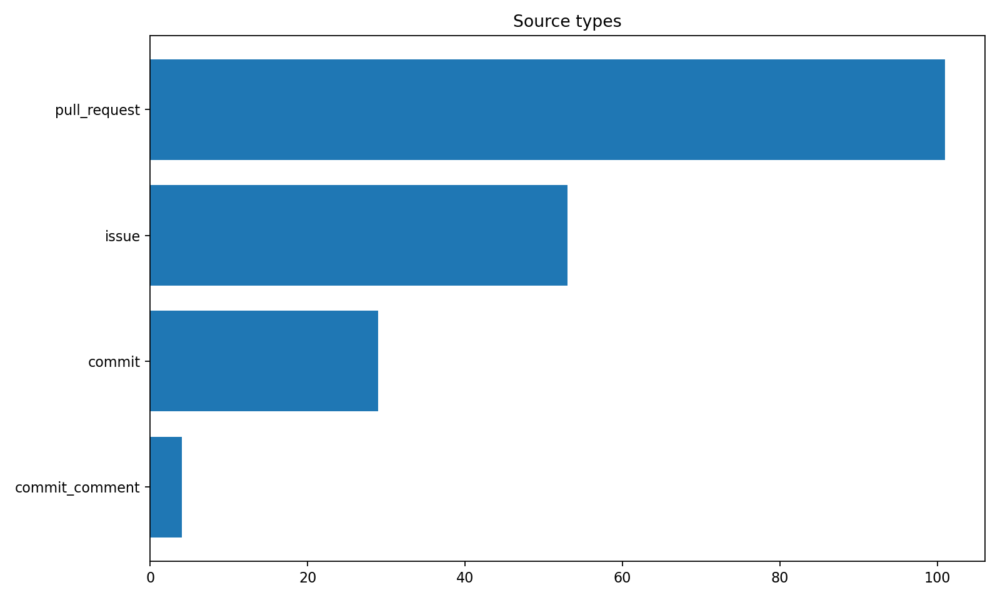
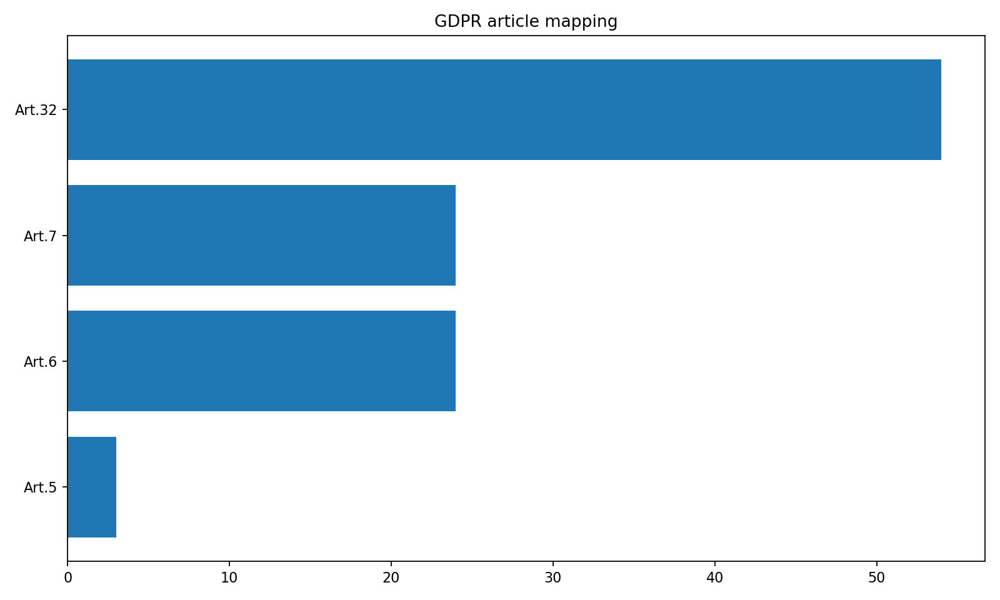

# Privacy-SATD Miner: First Results

We built a pipeline to scan public OSS repositories for privacy-related self-admitted technical debt. This is an early signal scan that can support later validation and dataset curation. It does not assess compliance.

## Results
- 186 filtered instances across 35 repos
- Top keywords: tracking, encryption, consent
- GDPR mapping skewed toward Art.32, Art.6, Art.7

## Figures

## References
- Diaz Ferreyra, Shahin, Zahedi, Quadri, Scandariato. MSR 2024. DOI: 10.1145/3643991.3644909
- Diaz Ferreyra, Khelifi, Arachchilage, Scandariato. arXiv:2412.16667

Links:
Website: [WEBSITE URL]
GitHub: https://github.com/SYEDIBRAHIMKHALIL/Privacy-SATD
